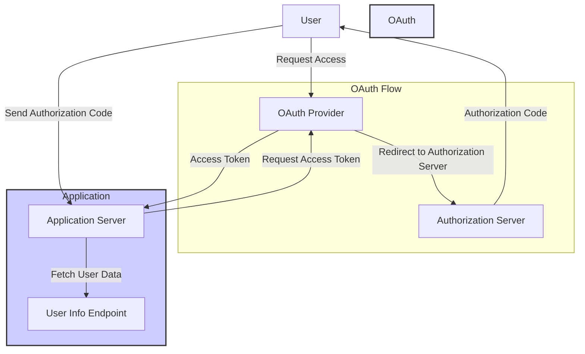

To create a Node.js project that uses OAuth authentication with Google, 
Facebook, GitHub, and other social media platforms, you can use the 
passport.js middleware. Here's a basic project setup with Passport and 
OAuth for multiple platforms:



## 1. Initialize a Node.js project

```bash
mkdir oauth-authentication
cd oauth-authentication
npm init -y
```

## 2. Install necessary packages

```bash
npm install express passport passport-google-oauth20 passport-facebook 
passport-github express-session dotenv
```

express: Web framework for Node.js.
passport: Authentication middleware for Node.js.
passport-google-oauth20: Passport strategy for Google OAuth.
passport-facebook: Passport strategy for Facebook OAuth.
passport-github: Passport strategy for GitHub OAuth.
express-session: Middleware to manage user sessions.
dotenv: Manage environment variables.

## 3. Create project structure

```bash
.
├── app.js
├── config
│   ├── passport-setup.js
├── .env
└── views
    ├── home.ejs
    ├── profile.ejs
```

## 4. Create .env file
Add your OAuth client credentials to the .env file.

```.env
GOOGLE_CLIENT_ID=your_google_client_id
GOOGLE_CLIENT_SECRET=your_google_client_secret

FACEBOOK_CLIENT_ID=your_facebook_client_id
FACEBOOK_CLIENT_SECRET=your_facebook_client_secret

GITHUB_CLIENT_ID=your_github_client_id
GITHUB_CLIENT_SECRET=your_github_client_secret

SESSION_SECRET=your_session_secret
```

5. Set up Passport.js strategies in passport-setup.js

```javascript
const passport = require('passport');
const GoogleStrategy = require('passport-google-oauth20').Strategy;
const FacebookStrategy = require('passport-facebook').Strategy;
const GitHubStrategy = require('passport-github').Strategy;

// Serialize and deserialize user
passport.serializeUser((user, done) => {
    done(null, user);
});

passport.deserializeUser((user, done) => {
    done(null, user);
});

// Google OAuth Strategy
passport.use(new GoogleStrategy({
    clientID: process.env.GOOGLE_CLIENT_ID,
    clientSecret: process.env.GOOGLE_CLIENT_SECRET,
    callbackURL: '/auth/google/redirect'
}, (accessToken, refreshToken, profile, done) => {
    done(null, profile);
}));

// Facebook OAuth Strategy
passport.use(new FacebookStrategy({
    clientID: process.env.FACEBOOK_CLIENT_ID,
    clientSecret: process.env.FACEBOOK_CLIENT_SECRET,
    callbackURL: '/auth/facebook/redirect'
}, (accessToken, refreshToken, profile, done) => {
    done(null, profile);
}));

// GitHub OAuth Strategy
passport.use(new GitHubStrategy({
    clientID: process.env.GITHUB_CLIENT_ID,
    clientSecret: process.env.GITHUB_CLIENT_SECRET,
    callbackURL: '/auth/github/redirect'
}, (accessToken, refreshToken, profile, done) => {
    done(null, profile);
}));
```

## 6. Create the app.js file

```javascript
const express = require('express');
const passport = require('passport');
const session = require('express-session');
require('dotenv').config();
require('./config/passport-setup');

const app = express();

// Middleware for sessions
app.use(session({
    secret: process.env.SESSION_SECRET,
    resave: false,
    saveUninitialized: false
}));

// Initialize passport and sessions
app.use(passport.initialize());
app.use(passport.session());

// Set view engine
app.set('view engine', 'ejs');

// Routes
app.get('/', (req, res) => {
    res.render('home');
});

app.get('/profile', (req, res) => {
    res.render('profile', { user: req.user });
});

// Auth Routes
app.get('/auth/google', passport.authenticate('google', {
    scope: ['profile', 'email']
}));

app.get('/auth/google/redirect', passport.authenticate('google'), (req, 
res) => {
    res.redirect('/profile');
});

app.get('/auth/facebook', passport.authenticate('facebook'));

app.get('/auth/facebook/redirect', passport.authenticate('facebook'), 
(req, res) => {
    res.redirect('/profile');
});

app.get('/auth/github', passport.authenticate('github'));

app.get('/auth/github/redirect', passport.authenticate('github'), (req, 
res) => {
    res.redirect('/profile');
});

// Logout
app.get('/logout', (req, res) => {
    req.logout(() => {
        res.redirect('/');
    });
});

// Start server
app.listen(3000, () => {
    console.log('Server running on http://localhost:3000');
});
```

## 7. Views (EJS files)
home.ejs: The home page where users can log in.

```html
<!DOCTYPE html>
<html>
<head>
    <title>Home</title>
</head>
<body>
    <h1>Welcome</h1>
    <a href="/auth/google">Login with Google</a>
    <a href="/auth/facebook">Login with Facebook</a>
    <a href="/auth/github">Login with GitHub</a>
</body>
</html>
```

profile.ejs: The profile page shown after login.


```html
<!DOCTYPE html>
<html>
<head>
    <title>Profile</title>
</head>
<body>
    <h1>Profile</h1>
    <h2>Welcome <%= user.displayName %></h2>
    <a href="/logout">Logout</a>
</body>
</html>
```
## 8. Running the project
To run the project, use the following command:

```bash
node app.js
```

Now, open http://localhost:3000 to start the OAuth flow with Google, 
Facebook, or GitHub.

## Additional Social Media OAuth
To add more OAuth providers, install their respective passport strategy 
(e.g., passport-twitter, passport-linkedin, etc.) and follow a similar 
setup.
